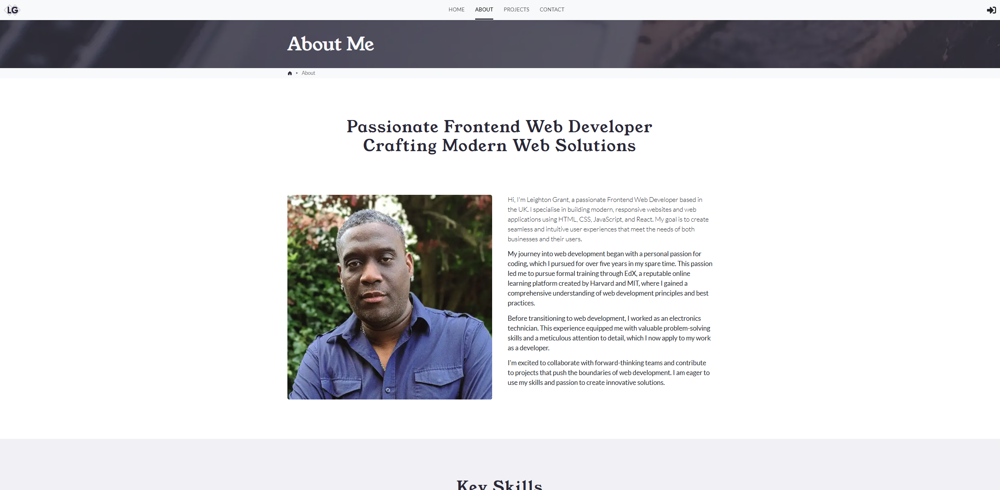

# My Portfolio



This is my personal portfolio website, built with modern web technologies to showcase my skills, projects, and experience as a software engineer.

**Live Demo:** [your-portfolio-url.com](https://leightongrant.me)

## ✨ Features

-   **Responsive Design:** Looks great on all devices, from mobile phones to desktops.
-   **Project Showcase:** A dedicated section to display my work with details, links, and images.
-   **About Me:** A section to introduce myself, my background, and my passion for development.
-   **Skills Section:** Highlighting my technical skills and proficiencies.
-   **Contact Form:** A functional contact form for visitors to get in touch.
-   **Fast & Performant:** Optimized for a smooth and fast user experience.

## 🛠️ Tech Stack

This project is built using the following technologies:

-   **[React](https://reactjs.org/)**: A JavaScript library for building user interfaces.
-   **[TypeScript](https://www.typescriptlang.org/)**: A typed superset of JavaScript that compiles to plain JavaScript.
-   **[React Bootstrap](https://react-bootstrap.github.io/)**: For styling the application.
-   **[Vite](https://vitejs.dev/)**: For project setup and development server.
-   **[Netlify](https://www.netlify.com/)**: For continuous deployment and hosting.

## 🚀 Getting Started

To get a local copy up and running, follow these simple steps.

### Prerequisites

You need to have [Node.js](https://nodejs.org/) and [npm](https://www.npmjs.com/)installed on your machine.

### Installation

1.  Clone the repo
    ```sh
    git clone https://github.com/leightongrant/my-portfolio.git
    ```
2.  Navigate to the project directory
    ```sh
    cd my-portfolio
    ```
3.  Install NPM packages
    ```sh
    npm install
    ```

## 📜 Available Scripts

In the project directory, you can run:

### `npm dev`

Runs the app in development mode.\
Open http://localhost:5713 (or another port, check your console) to view it in the browser.

The page will reload if you make edits.\
You will also see any lint errors in the console.

### `npm run build`

Builds the app for production to the `build` or `dist` folder.\
It correctly bundles React in production mode and optimizes the build for the best performance.

The build is minified and the filenames include hashes for caching.\
Your app is ready to be deployed!

## 部署 (Deployment)

This site is automatically deployed to Netlify from the `main` branch. Any push to `main` will trigger a new build and deployment.

## 📄 License

Distributed under the MIT License. See `LICENSE.txt` for more information.

## 🙏 Acknowledgements

-   README.so for the template inspiration.
-   Icons from React Icons.
